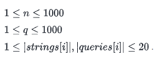

# HackerRank Sparse Arrays solver (Test MdM)
> This app solves the sparse arrays problem presented by HackerRank ([link](https://www.hackerrank.com/challenges/sparse-arrays/problem)) using a flask REST API and a swagger documentation. 

This program builds a REST API which finds the occurrences of a user specified string queries into a predifined list of strings.
You can either run this app locally or run it on a docker container (see the installation and how to use procedures below).

## Installation

The project requires a python 3.x interpreter.
First clone the repo.
```sh
git clone https://github.com/loicbausor/sparse_arrays_solver.git
```
Then install the requirements in the app folder.

```sh
pip install -r requirements.txt
```


## How to use this app locally

First you need to specify an environement variable with the string list you want to investigate. The name of this variable should be `SPARSE_ARRAY_STRINGS` and the format of this one has to be a quoted list. For example we may define (for linux distributions) :

```sh
export ARRAY_PATH='["my","strings","abc","acb"]'
```
Then run the main.py in the app folder.
```sh
python3 -m main 
```
At this time you can either :
* Go to the specified http link to see the swagger API documentation (by default it will be http://0.0.0.0:5000/ but is changeable in the last line of the main.py module). 
* Make a curl request to the server (at http://0.0.0.0:5000/array/occurrences)  to find the occurrences of the comma separated queries of your choice at . For example we could request : 
```sh
curl http://0.0.0.0:5000/array/occurrences/query1,query2,query3
```
The query will return a JSON object with the queries and their occurences. The queries and the string array specified must match the Sparse Arrays problem constraints (see the constraints paragraph below).

## How to use this app on docker

At the location of the repo, you can build the docker image like this.

```sh
docker build . -t name_of_image
```
The Dockerfile will run the app installation. You can change the ENV variable directly into it to specify the strings of your choice (change the buildtime_variable value). 
You can then run the container using this command (you can change the ports arguments if needed and add some arguments).

```sh 
docker run -p 5000:5000 name_of_image
```
Then you can request the API in the same way as the local use.


## Project composition
This project is composed of two files :

#### 1) The sparse_arrays.py module
This module contains the class `QueryBuilder`. This class groups a query list and a strings list to do the occurrences research.
**Arguments :**
1. `query` : A list (or tuple) containing all the string queries specified by the user. Those queries have to respect the constraintsof the Sparse Arrays problem (specified on the paragraph below)
2. `strings` : A list (or tuple) containing all the strings the user wants to search into. Those strings have also to respect the constraints of the Sparse Arrays problem (specified on the paragraph below)

The class constructor will raise a **ValueError** or a **TypeError** if the constraints are not respected. 

**Methods :**
- `QueryBuilder.search()`
Searches the occurrences of strings of `query` into the `strings` list. It returns a dictionnary mapping the string queries with their occurrences in the list.

#### 2) The main.py module
This module collects the different variables (for example the strings in the environement variable) and builds the API. At each request the `QueryBuilder` searches for the occurences and returns the result.

#### 3) The requirements.txt file
It groups all the package requirements for this project. It inculdes `flask` , `flask_restful` and `wertzeurg`.

#### 4) The Dockerfile to dockerize the app
This file allows you to make run the app on a docker container.

## Sparse Arrays constraints

The arguments given to the program  have to respect the following constraints.




Where n is the  length and q the strings length.
The two variable have to be lists or tuples  

## Meta

Loïc Bausor –– loic.bausor@gmail.com
